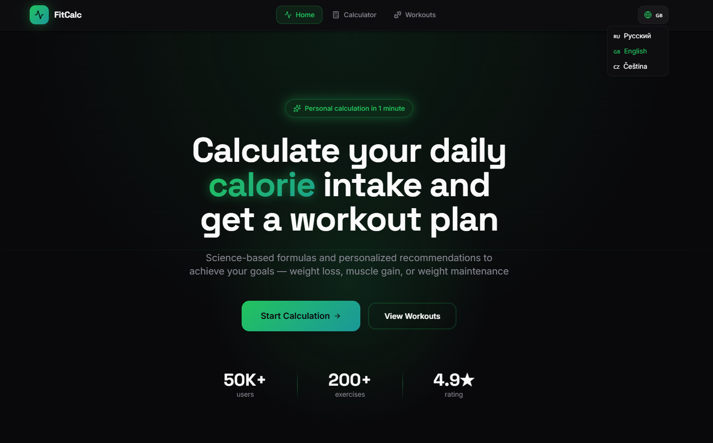
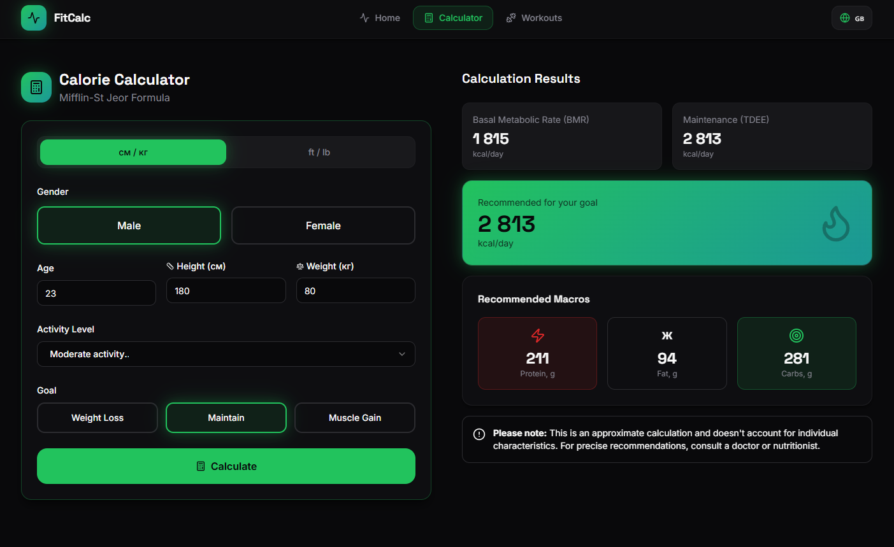

# 🏋️ FitCalc - Fitness Calculator & Workout Planner

A comprehensive fitness application built with React, TypeScript, and Tailwind CSS. Calculate your daily calorie needs and get personalized workout plans based on your body type and fitness goals.


## ✨ Features

### 📊 Calorie Calculator
- **Mifflin-St Jeor Formula** - Science-based BMR and TDEE calculations
- **Personalized Recommendations** - Customized calorie and macro targets
- **Multiple Goals** - Weight loss, maintenance, or muscle gain
- **Activity Level Tracking** - From sedentary to extreme activity
- **Metric & Imperial Units** - Support for both measurement systems

### 💪 Workout Planner
- **Body Type Programs** - Tailored for Ectomorph, Mesomorph, and Endomorph
- **3 Fitness Levels** - Beginner, Intermediate, and Advanced plans
- **Home & Gym Workouts** - Programs for any training environment
- **Equipment Flexibility** - Bodyweight, dumbbells, barbells, and more
- **200+ Exercises** - Comprehensive exercise database with proper form

### 🌍 Multi-Language Support
- **3 Languages** - English, Russian, Czech
- **Localized Content** - Full translation of all UI elements
- **Persistent Preference** - Language choice saved to localStorage

### 🎨 Modern UI/UX
- **Dark Theme** - Eye-friendly dark mode design
- **Responsive Layout** - Optimized for mobile, tablet, and desktop
- **Smooth Animations** - Polished user experience with Tailwind animations
- **Accessible Components** - Built with Radix UI primitives

## 🚀 Tech Stack

### Core
- **React 19.2** - Latest React with concurrent features
- **TypeScript 5.9** - Type-safe development
- **Vite 7.2** - Lightning-fast build tool
- **React Router 7.12** - Client-side routing

### UI & Styling
- **Tailwind CSS 3.4** - Utility-first CSS framework
- **Radix UI** - Accessible component primitives
- **Lucide React** - Beautiful icon library
- **Sonner** - Toast notifications
- **Recharts** - Data visualization (for progress tracking)

### State & Data
- **TanStack Query 5.90** - Server state management
- **React Context** - Global language state
- **LocalStorage** - Persistent user preferences

### Code Quality
- **ESLint 9** - Code linting
- **TypeScript ESLint** - TypeScript-specific linting rules

## 📦 Installation

### Prerequisites
- Node.js 18+ 
- npm or yarn

### Setup

1. **Clone the repository**
```bash
git clone <your-repo-url>
cd fitness-calculator
```

2. **Install dependencies**
```bash
npm install
# or
yarn install
```

3. **Run the development server**
```bash
npm run dev
# or
yarn dev
```

4. **Open your browser**
````markdown
Navigate to `http://localhost:5173` to see the app in action.
````

## 📚 Usage

1. **Calorie Calculator**
- Go to the Calorie Calculator section
- Select your goal: Weight Loss, Maintenance, or Muscle Gain
- Enter your details: Age, Gender, Weight, Height, Activity Level
- View your daily calorie and macro targets

2. **Workout Planner**
- Go to the Workout Planner section
- Select your body type: Ectomorph, Mesomorph, or Endomorph
- Choose your fitness level: Beginner, Intermediate, or Advanced
- View your personalized workout plan

3. **Multi-Language Support**
- Click on the language selector
- Choose your preferred language: English, Russian, or Czech
- The app will reload with the selected language

4. **Dark Theme**
- Toggle the dark theme switch
- Enjoy the eye-friendly dark mode design

## 📸 Screenshots

### Home Page


### Calorie Calculator


### Workout Planner


### Additional View


## 🤝 Contributing

We welcome contributions to FitCalc! To contribute, please follow these steps:

1. Fork the repository
2. Create a new branch: `git checkout -b feature/YourFeature`
3. Make your changes
4. Commit your changes: `git commit -m 'Add your feature'`
5. Push to the branch: `git push origin feature/YourFeature`
6. Create a pull request

Please make sure your code follows the existing style and passes all tests.

---

Made with ❤️ by [Dias & AI)]
